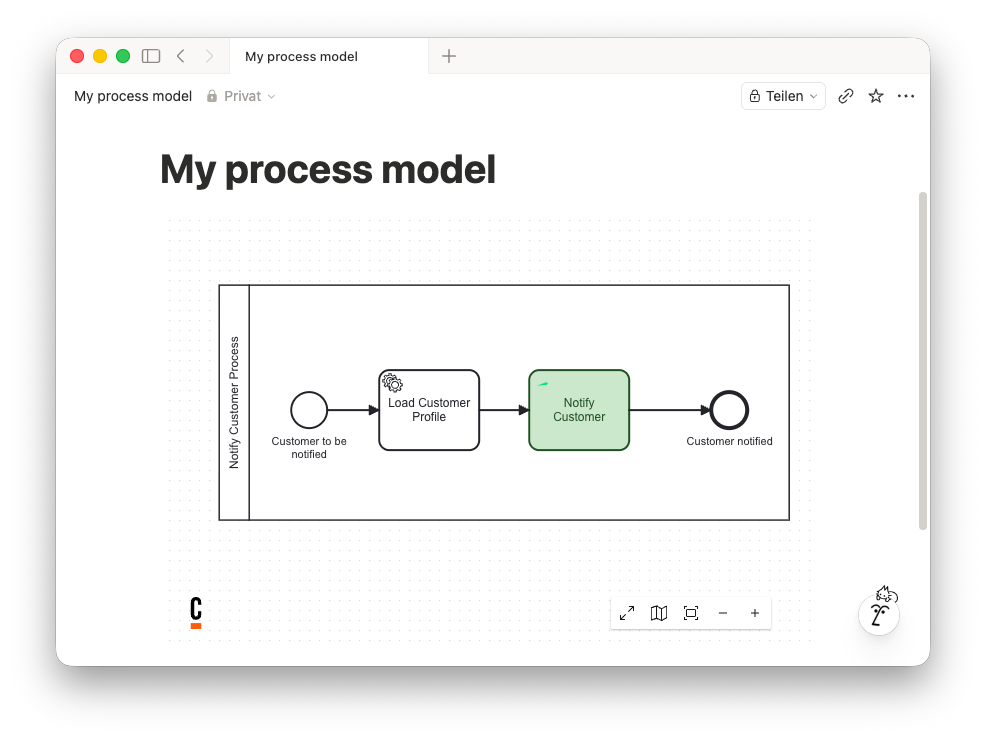

[![MIT License][license-shield]][license-url]
[![Issues][issues-shield]][issues-url]
[![Stars][stars-shield]][stars-url]

# Camunda Diagram → Notion Embed

**Put live Camunda 8 (camunda.io) and Cawemo BPMN diagrams directly into your Notion pages.**

👉 **[Open the tool](https://miragon-camunda-diagram-notion-embed.netlify.app)**



## Why?

Notion can't embed a camunda.io or Cawemo diagram out of the box. The usual workaround is to
drop in a screenshot — which is stale the moment the process changes, and can't be zoomed or panned.

This tool gives you a URL you can paste into any Notion `/embed` block. The result is the **live,
always-current diagram**, rendered right inside your document — no screenshots, no account, no
tracking. It's a single HTML page you can use as-is or self-host.

## How to use it

1. Open **[the tool](https://miragon-camunda-diagram-notion-embed.netlify.app)**.
2. In camunda.io or Cawemo, open your diagram and copy its **Share** link.
3. Paste the link into the tool, click **Go**, then **Copy**.
4. In Notion, type `/embed`, paste the copied URL, and press Enter.

Your diagram now renders live in the page.

> [!IMPORTANT]
> The share link must be a **public** link — anyone with the URL needs to be able to open the
> diagram. Notion loads it directly from camunda.io / Cawemo, so a private or login-protected link
> won't render.

## How it works

The whole app is one static `index.html` — no backend, no build step, no dependencies.

- It takes your **share** URL and rewrites `share` → `embed` to get Camunda's embeddable view.
- It wraps that as `…/?u=<encoded-embed-url>` — the URL you paste into Notion.
- When the page is opened with `?u=`, it renders the embed URL in a full-screen `<iframe>`, which
  is exactly what Notion's embed block loads.

## Run or self-host

It's a static file, so any static host works. To run it locally:

```bash
git clone https://github.com/Miragon/camunda-diagram-notion-embed.git
cd camunda-diagram-notion-embed
python3 -m http.server 8000   # then open http://localhost:8000
```

Built with plain HTML, CSS, and vanilla JavaScript.

## Contributing

Contributions are welcome — see [CONTRIBUTING.md](CONTRIBUTING.md) for how to get started, and
please open an [issue](https://github.com/Miragon/camunda-diagram-notion-embed/issues) for bugs or
feature ideas. All participation is governed by our [Code of Conduct](CODE_OF_CONDUCT.md).

## License

Distributed under the MIT License. See [`LICENSE`](LICENSE) for details.

<!-- MARKDOWN LINKS & IMAGES -->
[license-shield]: https://img.shields.io/github/license/Miragon/camunda-diagram-notion-embed.svg?style=for-the-badge
[license-url]: https://github.com/Miragon/camunda-diagram-notion-embed/blob/main/LICENSE
[issues-shield]: https://img.shields.io/github/issues/Miragon/camunda-diagram-notion-embed.svg?style=for-the-badge
[issues-url]: https://github.com/Miragon/camunda-diagram-notion-embed/issues
[stars-shield]: https://img.shields.io/github/stars/Miragon/camunda-diagram-notion-embed.svg?style=for-the-badge
[stars-url]: https://github.com/Miragon/camunda-diagram-notion-embed/stargazers
